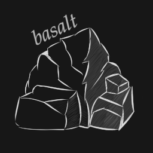
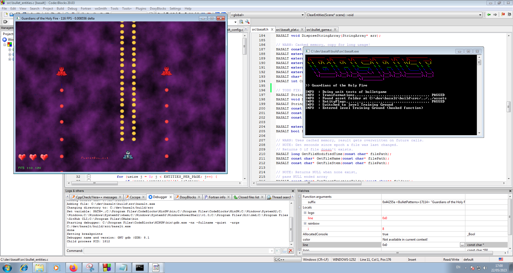
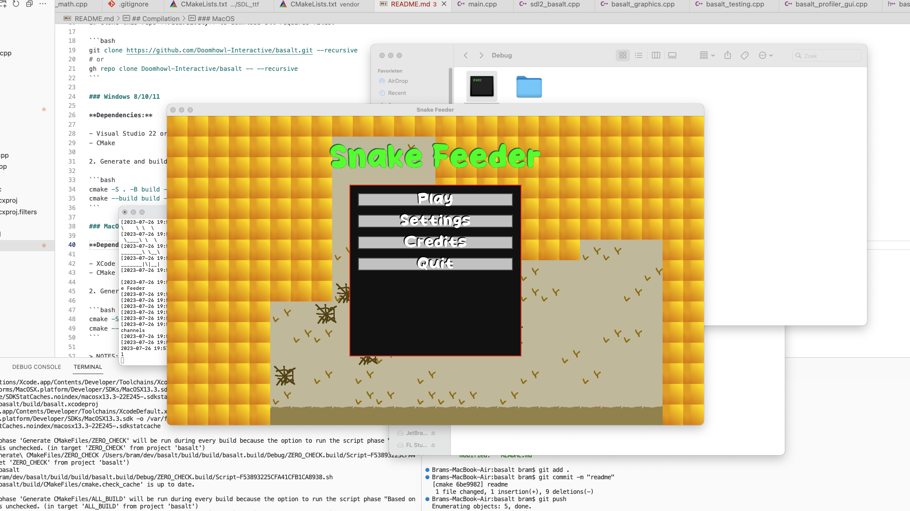

Software rendered game engine based on SDL3 for C++ cavemen

Solidified version of [Magma Game Engine](https://github.com/bramtechs/RaylibMagmaEngine) and [dream-emu](https://github.com/bramtechs/dream-emu).

Inspired by [Raylib](https://github.com/raysan5/raylib).

## Bindings

- Go (planned)
- Javascript (NodeJS) (planned, maybe)

## Compilation

1. Clone this repo **recursively** to download all required files.

```bash
git clone https://github.com/Doomhowl-Interactive/basalt.git --recursive
# or
gh repo clone Doomhowl-Interactive/basalt -- --recursive
```

### Windows 8/10/11

**Dependencies:**

- Visual Studio 22 or VS Build Tools 2019
- CMake

2. Generate and build with cmake.

```bash
cmake -S . -B build -G "Visual Studio 17 2022" -A x64 -DCMAKE_BUILD_TYPE=Release
cmake --build build --parallel
```

### MacOS

**Dependencies:**

- XCode
- CMake

2. Generate and build with cmake.

```bash
cmake -S . -B build -G Xcode
cmake --build build --parallel --config Release
```

> NOTE: The Xcode build generator needs to be used or the build will fail.

> NOTE: SDL3 (master branch of SDL) is compiled and statically compiled with basalt,
> so the first compilation may take a while...

## Screenshots



