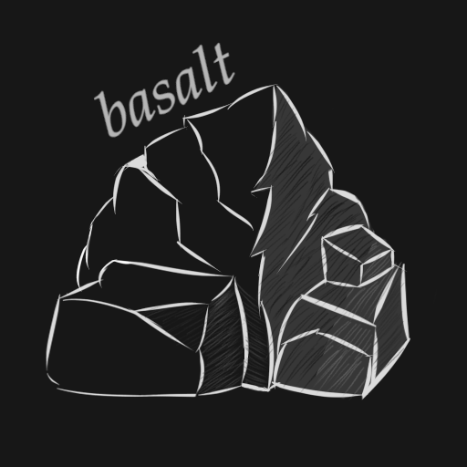

# basalt
game engine for c cavemen 

Slowly solidifying [Magma Game Engine](https://github.com/bramtechs/RaylibMagmaEngine) and [dream-emu](https://github.com/bramtechs/dream-emu).

Inspired by [Handmade Hero](https://handmadehero.org/).

## Screenshots

## New goals
- C over C++ (support both types of compilers)
- Platform agnostic (POSIX-compliant)
- Batteries included, no downloading dependencies/libraries.
- Embed game assets into executable (instead of seperate file)
- High backwards-compatibility (Windows XP support and later)
- All tooling is written in-engine.

- No CMake (use plain old .bat script)
- No Entity Component Systems (too complicated)
- No graphics cards! -> write graphics straight into memory (as seen in [olive.c library](https://github.com/tsoding/olive.c))

## Long-term goals
- WASM-browser support
- Actually make a game I guess

## Dumb/unrealistic goals
- ~~Reimplement C standard library (needed for WASM-support anyway)~~
- Arduino Uno support (communicate graphics over serial connection)
- Run game in the bootloader without OS (with limited functionality)
